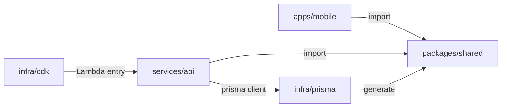

# Trecord — 日々の努力を可視化する筋トレ記録アプリ <!-- omit in toc -->

[](https://apps.apple.com/app/id6754829217)
[](https://play.google.com/store/apps/details?id=com.rarzyu.trecord)
[](https://trecord.rarzyu.com/ja/)

毎日のトレーニング内容と体重を記録し、グラフで成長を可視化、SNSでシェアできる画像も自動生成する個人開発アプリ。React Native + Express(AWS Lambda) + RDS(PostgreSQL) のフルスタック構成を1人で設計・実装・運用しています。

> このREADMEは「Trecord で何を考え、どう作ったか」を採用担当者・他のエンジニアに向けて伝えることを目的にしています。リポジトリ自体はprivate管理のため、ここでは設計・運用の意思決定を中心に記載します。

- [1. なぜ作ったか](#1-なぜ作ったか)
- [2. 解決したかった課題と機能の対応](#2-解決したかった課題と機能の対応)
  - [5つの入力パターンで種目特性に対応](#5つの入力パターンで種目特性に対応)
  - [種目カスタマイズ](#種目カスタマイズ)
  - [1RM自動計算・ボリューム保持](#1rm自動計算ボリューム保持)
  - [成長の可視化](#成長の可視化)
  - [シェア用データ・PR判定の自動生成](#シェア用データpr判定の自動生成)
  - [8言語対応](#8言語対応)
- [3. 技術選定の理由](#3-技術選定の理由)
  - [モバイル — React Native (Expo) + TypeScript](#モバイル--react-native-expo--typescript)
  - [モバイル状態管理 — React Context + TanStack Query](#モバイル状態管理--react-context--tanstack-query)
  - [モバイルフォーム — React Hook Form + Yup](#モバイルフォーム--react-hook-form--yup)
  - [API — Express on AWS Lambda（`@vendia/serverless-express`）](#api--express-on-aws-lambdavendiaserverless-express)
  - [DB — PostgreSQL (Amazon RDS) + Prisma](#db--postgresql-amazon-rds--prisma)
  - [認証 — Amazon Cognito + AWS Amplify](#認証--amazon-cognito--aws-amplify)
  - [インフラ管理 — AWS CDK （TypeScript）](#インフラ管理--aws-cdk-typescript)
  - [コスト最適化 — NAT Instance (t4g.nano) + S3 Gateway Endpoint](#コスト最適化--nat-instance-t4gnano--s3-gateway-endpoint)
  - [Webサイト — Astro + Tailwind + Cloudflare Pages](#webサイト--astro--tailwind--cloudflare-pages)
  - [多言語対応 — i18next（モバイル）/ 独自i18n + `getStaticPaths`（Astro）](#多言語対応--i18nextモバイル-独自i18n--getstaticpathsastro)
  - [モノレポ — pnpm + Turborepo](#モノレポ--pnpm--turborepo)
  - [CI/CD — GitHub Actions（`dev.yaml` / `prod.yaml`）](#cicd--github-actionsdevyaml--prodyaml)
  - [広告 / 課金 — AdMob + `react-native-iap`](#広告--課金--admob--react-native-iap)
- [4. 設計で意識したこと](#4-設計で意識したこと)
  - [4.1 共有パッケージ（`/shared`）で型を一元化](#41-共有パッケージsharedで型を一元化)
  - [4.2 ドメインモデル：5つの入力パターン](#42-ドメインモデル5つの入力パターン)
  - [4.3 API設計（Protected / Public の責務分離）](#43-api設計protected--public-の責務分離)
  - [4.4 インフラ：守りつつ節約する設計](#44-インフラ守りつつ節約する設計)
- [5. UI / UX で意識したこと](#5-ui--ux-で意識したこと)
- [6. 運用で見ていること](#6-運用で見ていること)
- [7. テスト・品質担保](#7-テスト品質担保)
- [8. 今後改善したいこと](#8-今後改善したいこと)
- [9. このプロジェクトで得た経験 → 業務での再現性](#9-このプロジェクトで得た経験--業務での再現性)
- [10. プロジェクトの構成（概要）](#10-プロジェクトの構成概要)


## 1. なぜ作ったか
ジムでの筋トレにはまり始めたとき、Notionで記録していたのですが、この管理方法に3つの課題を感じました
1. トレーニングの名称・入力方法が覚えられない
    - ダンベルの場合は片手ずつ、マシンなども名称が覚えられないのでいちいち過去の記録をさかのぼる必要があった
2. 記録しているだけで成長しているのかどうかは自分の記憶次第
    - 重量は記憶しているが、体重との関係やRM換算したときに成長しているかどうかが全くわからなかった
3. SNS映えしない
    - スクショをそのままSNSに上げていたが、見づらい上に黒い画面で映えなかった

これら、特に2と3は競合アプリでも意外と解決されていないと感じていて、**「日々の努力が実感しづらい」「せっかくの成長をシェアしづらい」** という課題を解決したいと思ったのが開発の動機です。


## 2. 解決したかった課題と機能の対応

### 5つの入力パターンで種目特性に対応
種目によって記録したいパターンが違う（重量×回数 / 距離×時間 / 回数のみ / 左右別 / アシスト付き）という課題に対し、**5つの入力パターン**を実装して種目ごとに最適な入力UIを出し分け（[4.2](#42-ドメインモデル5つの入力パターン)）。

### 種目カスタマイズ
種目名・分類が画一的で個人のトレーニング様式に合わない課題に対し、ユーザー単位での **種目カスタマイズ**（追加・名前変更・並び替え・タグ付け）を提供。

### 1RM自動計算・ボリューム保持
1RMやボリュームがわからないという課題に対し、セット入力時に **O'Connerの式（`重量 × 回数 / 40 + 重量`）で1RMを自動推定**、種目レベルで `totalVolume` を保持。

### 成長の可視化
成長を体感したいという課題に対し、種目別グラフ（最大重量・最大1RM・最大回数・ボリューム）+ 体重推移グラフを提供。

### シェア用データ・PR判定の自動生成
SNSシェア時の画像加工が面倒・自己ベストの気付きが弱い課題に対し、セッション結果から **シェア用データ + PR（自己ベスト）判定** を自動生成。

### 8言語対応
海外ユーザーにも届けたいという課題に対し、**8言語対応**（ja / en / zh / ko / es / fr / de / pt_BR）。


## 3. 技術選定の理由

### モバイル — React Native (Expo) + TypeScript
- **理由**：
  - TypeScriptで書けてiOS・Android両対応をワンソースで実現できる
  - Expoで個人開発の運用コストを抑える
- **比較検討**：
  - Flutter（過去の個人開発で使用済。TypeScriptに軸足を寄せたいため不採用）
    - ExpoがFlutterに比べてネイティブを触らなくてもいいのが非常に使いやすかった
      - また、Flutterはツールとしてインストール・管理が必要だが、React Nativeはライブラリとしての管理なので他PJを汚さなくて済むのが非常に良かった
    - 合わせて、TypeScriptが流行っており、業務での需要も高かったので勉強もかねて採用
  - ネイティブ（個人開発の工数では2プラットフォームを運用しきれない）

### モバイル状態管理 — React Context + TanStack Query
- **理由**：
  - サーバーステートとUIステートを明確に分離
  - staleTime 30分でAPIコール削減
- **比較検討**：
  - Redux Toolkit / Zustand
    - 正直そこまで状態管理で複雑にするようなシステムでもないので、ここは見送った

### モバイルフォーム — React Hook Form + Yup
- **理由**：
  - 5つの入力パターンごとに別スキーマを切り替える要件に強い
  - React Hook FormはYupとの相性も良く、バリデーションロジックをパターンごとに切り替える要件にマッチしていたため採用
- **比較検討**：
  - Formik / 自前

### API — Express on AWS Lambda（`@vendia/serverless-express`）
- **理由**：
  - Expressで実装しつつ、Lambdaで「使った分だけ課金」に 
    - Expressは別（Hono等）への移行を検討中
  - API Gateway HTTP API v2でJWT検証を委譲
- **比較検討**：
  - Java等
    - AWSかつ、低コストにするためにLambdaを前提としたとき、Node.jsが最も相性が良かった
    - Pythonもあるが、モバイル・フロント・バックエンドで1つの言語で統一し、共通処理などをモノレポ構成で共有できるようにしたかったため見送った

### DB — PostgreSQL (Amazon RDS) + Prisma
- **理由**：
  - 階層構造（Record → Frequency → Item → Set）がリレーショナル要件強め
  - Prismaで型生成・マイグレーション・query builderが揃う
- **比較検討**：
  - DynamoDB：複雑な集計が辛い
  - Supabase：AWS統合のしやすさを優先して見送り
  - Aurora：コストが高い 

### 認証 — Amazon Cognito + AWS Amplify
- **理由**：
  - API Gatewayの **HttpJwtAuthorizer** でJWT検証を完結
  - Google / Facebook / Apple のSNSログインを拡張容易
- **比較検討**：
  - Firebase Auth：AWSとの統合のしやすさを優先して見送り

### インフラ管理 — AWS CDK （TypeScript）
- **理由**：
  - アプリと同じ言語でIaC、Constructで構成を再利用
- **比較検討**：
  - コンソール上での操作
    - AI活用＋インフラに強くないこともあったので、コードで管理して変更履歴も残るCDKを選択
    - ただし、ACMやIAMなど、頻繁に更新しないものはコンソール上で管理を行っている

### コスト最適化 — NAT Instance (t4g.nano) + S3 Gateway Endpoint
- **理由**：
  - NAT Gateway（$30/月）が高すぎたため、 NAT Instance（**約 $3/月**）で1/10
  - Gateway Endpoint（無料）でVPC内からS3アクセス
  - また、EC2踏み台（ElasticIPなし） + SSHポートフォワードでDB接続を行っている
    - ElasticIPはEC2稼働させる＆接続されていないとコストがかかるので、DB接続のためだけにそのコストを払うのは厳しいと感じてコマンドから今のIPを取得し、ポートフォワードで接続する方式にしている
    - そのほかにも、開発環境はEventBridgeで毎晩EC2やRDSを停止する運用にし、出来るだけコストカットに努めている
- **比較検討**：
  - NAT Gateway：運用は楽だが高い
  - ElasticIP：DB接続のためだけにコストがかかるのは厳しいと感じて見送った

### Webサイト — Astro + Tailwind + Cloudflare Pages
- **理由**：
  - LP・利用規約・お問い合わせ・料金ページを静的化
  - Cloudflare Pagesで無料ホスティング
  - SSG + 8言語対応
- **比較検討**：
  - Next.js：静的サイトに対してオーバースペックで、工数がかかると思ったので見送り

### 多言語対応 — i18next（モバイル）/ 独自i18n + `getStaticPaths`（Astro）
- **理由**：
  - モバイル・Webで翻訳キー戦略を共通化
  - 日本語をSource of Truthとする型安全な運用

### モノレポ — pnpm + Turborepo
- **理由**：
  - `/shared` で型など、共通部品を流通
  - タスクキャッシュでCI高速化

### CI/CD — GitHub Actions（`dev.yaml` / `prod.yaml`）
- **理由**：
  - リポジトリ標準で無料枠で十分
  - 環境ブランチでデプロイを分離
- **比較検討**：
  - CodeCommit / CodePipeline：AWSに統合できるが、コストなどを考えるとGitHub Actionsで十分

### 広告 / 課金 — AdMob + `react-native-iap`
- **理由**：
  - Free
  - 有料プランの **広告 ON/OFF切り替え** がCSの基本要件
  - IAPでApple・Googleそれぞれのストア課金に対応


## 4. 設計で意識したこと

### 4.1 共有パッケージ（`/shared`）で型を一元化

`/shared` に **API契約 / Enum / ユーティリティ** を集約し、モバイル・API・Astroサイトのすべてが同じ型をimportする構成にしています。

Prismaスキーマから生成した型を `shared` 経由で公開することで、DBスキーマ変更時の追従漏れをコンパイル時に検出できます。

例：
```typescript
import type { TrainingFrequencyRequest } from '@trecord/shared';
import { datetimeUtil, enumUtil } from '@trecord/shared';
```

### 4.2 ドメインモデル：5つの入力パターン

「種目によって記録すべき数値が違う」という要件を、ジェネリックな `{key: value}` ではなく **`InputItemPatternKey` の離散ユニオン型** で表現しました。

| パターン | 主なフィールド | 種目例 |
| --- | --- | --- |
| `weight_rep` | `weight`, `rep`, `oneRm` | ベンチプレス、スクワット |
| `weight_and_rep_left_or_right` | + `leftOrRight` | ワンハンドダンベルカール |
| `weight_and_rep_weighted_assist` | + `assistType`, `assistWeight` | チンニング（補助 / 加重） |
| `rep_only` | `rep` | 腕立て伏せ、アブローラー |
| `distance_time` | `distance`, `timeMinute` | ランニング、トレッドミル |

この設計により：

- **バリデーション** をパターン単位のYupスキーマで切り替えられる
- **実効重量・1RM・PR判定** のロジックをパターン分岐で安全に書ける
- 後からパターンを追加する際、ユニオン型に追加するだけで **TypeScriptが分岐の網羅性をチェック**してくれる
- フロントの `TrainingSetList` / `SNSTrainingCard` をパターン別の **5バリアントのコンポーネント** に分離し、UIの責務を明確化

### 4.3 API設計（Protected / Public の責務分離）

| ルート | 認証 | 検証の置き場 | 用途 |
| --- | --- | --- | --- |
| `/v1/*` | 必須 | **API Gateway層**（HttpJwtAuthorizer） | ログイン後の全API |
| `/public/*` | 不要 | **Express層**（APIキー + レート制限 100req/15min） | アプリ情報（最新バージョン）など、ログイン前にも必要なAPI |

JWT検証をAPI Gateway層に寄せることで、Lambdaコールドスタート時の **Cognito JWKS取得コストを排除** しています。

一方、Public API側はAPIキー＋レート制限をExpress層で実装し、両ルートで適切な負荷対策を効かせています。

### 4.4 インフラ：守りつつ節約する設計

個人開発で固定費を抑えつつ、本番運用に耐える構成を目指しました。

- **Lambda はプライベートサブネット配置** → RDS（プライベート）に直接接続
- **NAT Instance（t4g.nano、$3/月）** で外部通信
  - NAT Gateway（$30/月）の1/10
- **S3 は VPC Gateway Endpoint（無料）** 経由でアクセスし、NATを経由しない
- **EC2踏み台 + SSHポートフォワード** でDB接続（開発時のみ）

> 個人開発でこそ「**運用コスト・セキュリティ・運用性のバランス**」を最後まで自分で意思決定できるのが価値だと考えています。


## 5. UI / UX で意識したこと

- **入力導線の最短化**：
  - トレーニングセッションの起票 → 種目追加 → セット入力までのタップ数を最小化
- **5つの入力パターン × 5バリアントのUI**：
  - 種目特性に合わせて入力UIを切り替え、誤入力を減らす
- **多言語（8言語）**：
  - `TK.task.add` 形式の **型安全な翻訳キー** で誤キーをコンパイル時検出
- **ダークモード**：
  - モバイル / Webサイト ともに対応
- **SNS用画像**：
  - 写真かシェアどちらでも行けるように2つ用意
  - シェアの場合は画像生成→SNSシェアをワンタップで完結させる


## 6. 運用で見ていること

- **APIログ**：CloudWatch Logs（Lambda）
- **エラー監視**：Sentryを導入し、APIとモバイル両方のエラーを収集
- **コスト監視**：AWS Budgets でアラート閾値を設定
- **ストア審査対応**：プライバシーポリシー・利用規約・特商法（必要時）をWebサイト側で公開し、審査時のURL差し戻しを防ぐ
- **ユーザーフィードバック**：お問い合わせフォームをモバイル・Webサイト両方に配置
  - モバイルの場合はDiscordに通知が届くような工夫も行った
- **サブスクリプション**：IAPレシート検証で **期限切れを自動判定**、`free` へフォールバック
- **毎週のマーケティングレポート**：他アプリも同様だが、Claudeを活用し、毎週ストア等の分析レポートを生成
  - これをもとに次週のアクションを見直している


## 7. テスト・品質担保

- **型チェック**：`pnpm typecheck`（Turbo経由で全ワークスペースを並列実行）
- **Lint / Format**：ESLint + Prettier で統一（実行は手動 / CI）
  - pre-commitフック（husky）は依存（`pnpm-lock.yaml`）変更時にライセンス情報を再生成
- **手動テスト**：ストア提出前のチェックリスト（5つの入力パターン × プラン × 8言語の組合せ要点を確認）をテンプレート化
  - リリース前に実機で一通りのパターンを確認する運用

> ユニットテストは現状ほぼ未整備ですが、実装予定です


## 8. 今後改善したいこと

- Web版の作成
  - もともと管理していたデータがあるが、いちいち入力するのも大変なので、Web版を作成し、そこでインポート/エクスポート機能を実装し、別アプリからの移行をスムーズにしたい
- Express → Hono など、より軽量なフレームワークへの移行
- テストコードの実装
  - 品質の担保のためにも、テストコードを実装する
  - 特にAPIはほとんどがテストコードできるロジックなので、ユニットテストを充実させたい
- ツールの導入
  - PostHog
    - ユーザーの行動を分析し、どの機能がどの程度使われているかを把握するために導入を検討
  - RevenueCat
    - 課金の管理を効率化するために導入を検討


## 9. このプロジェクトで得た経験 → 業務での再現性

- **AWS Lambda + RDS + VPC を個人で本番運用した経験**：
  - プライベートサブネット配置、NAT Instanceによるコスト最適化、API Gatewayでの認可設計を一気通貫で意思決定した経験は、事業会社のインフラ改善・コスト最適化の議論にも活かせると考えています
- **モノレポでの型流通設計**：
  - Prisma → `@shared` → アプリ / API の型一貫性を担保するパターンは、TypeScript製の中規模プロダクトに横展開可能
- **多言語対応の運用設計**：
  - 日本語をSource of Truthとして、型安全な翻訳キーで誤キーを排除する仕組み
- **個人開発の0 → 1 → 運用までを1人で完結**：
  - 要件定義 → 設計 → 実装 → ストア公開 → ユーザー対応 → 機能追加 までのフルサイクル経験
- **既存システムの保守改善の業務経験（SES）と接続**：
  - 直近のDify / AIツール案件で培った「**既存仕様 / 既存コードを読み解いて、保守性・安全性・運用性を意識しながら段階的に改善する**」アプローチを、自分のプロダクトに対しても同じ温度感で適用しています

---

## 10. プロジェクトの構成（概要）

```
trecord/
├── apps/
│   ├── mobile          React Native (Expo) モバイルアプリ
│   ├── web             Webアプリ（将来用）
│   └── website         Astro + Tailwind サイト（8言語）
├── services/
│   └── api             Express API（AWS Lambda）
├── packages/
│   └── shared          共有の型定義・ユーティリティ
├── infra/
│   ├── cdk             AWS CDKインフラ定義
│   └── prisma          Prismaスキーマ・マイグレーション
└── docs                設計ドキュメント（ER図・構成図・仕様書等）
```

ワークスペース間の依存関係：


